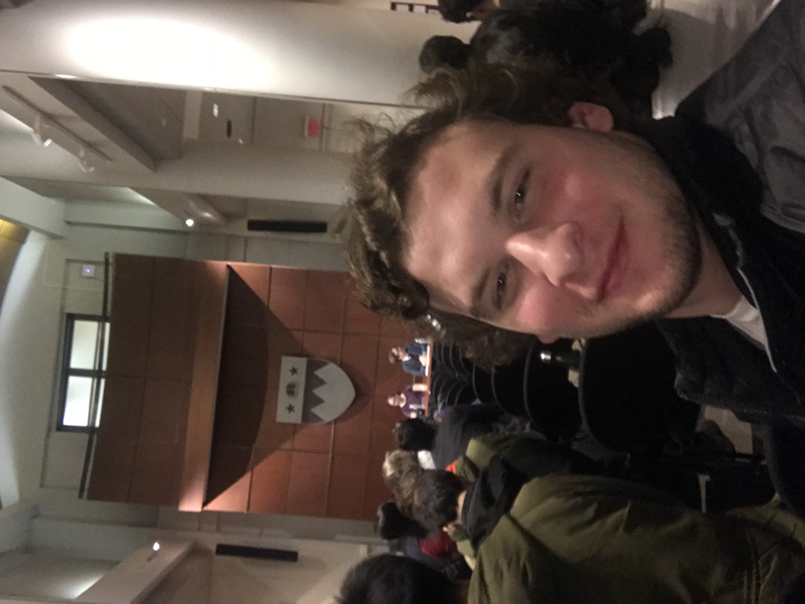
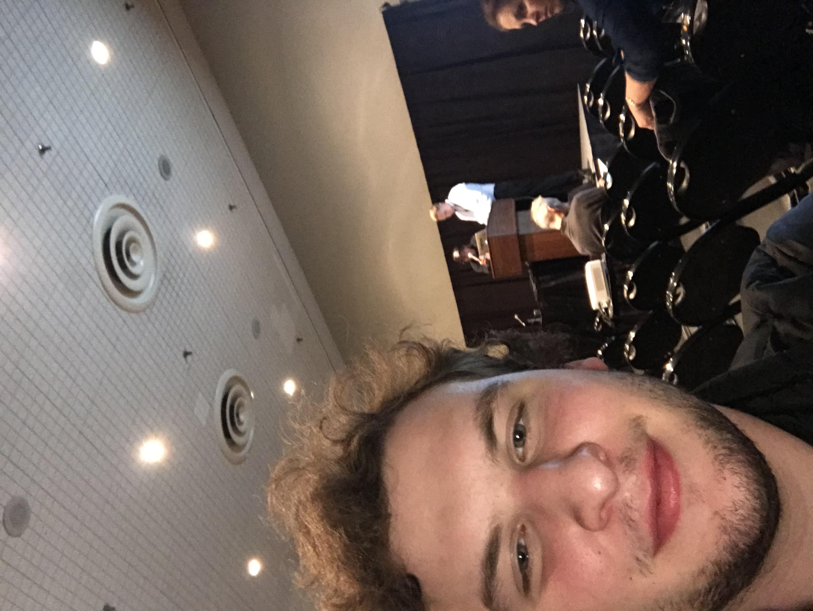

# BUGS

I went to the BUGS open data event on Monday March 5th. There were 3 speakers at the event. One of the main focuses of the
event was to describe/define open data. My favorite definition was from the librarian. She said to have open data, it needs
to be documented, readable, have comments, has to have a license, and be persistently made available. All in all, I liked the event!

# Maximizing the Value of Municipal Open Data APIs with Low Code Development Tools

The other event I went to was at the Javits center, and was being hosted by Oracle. All in all it was a good event, especially 
because I got a free t-shirt (haha) and because the Javits center is grandiose. The actual event was very informative. The speaker
Marc Sewtz, talked about municipal data, getting involved with open data, APIs, a term he called "Low Code Development," and 
then how to build applications on open data APIs.

